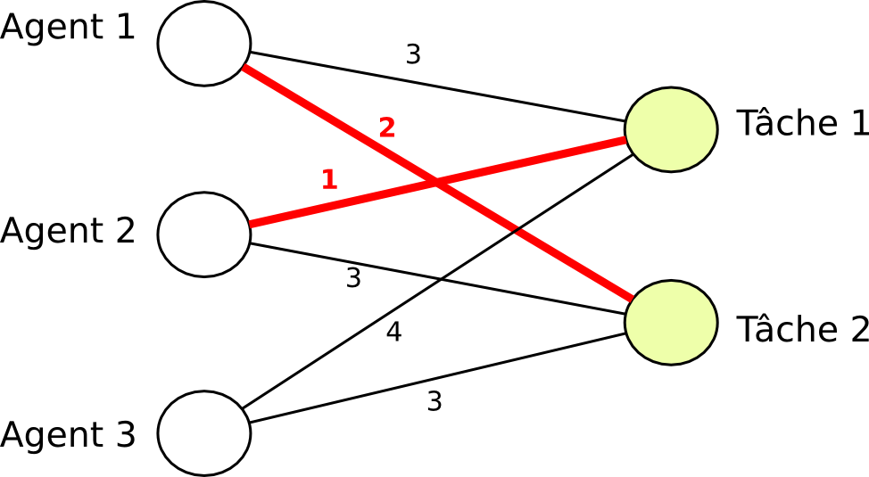

# L'algorithme hongrois

Le but de l’algorithme hongrois est d'assigner des agents aux tâches tout en minimisant la somme des coûts. on est certain d'avoir un minimum en temps polynomial.

L'algorithme peut aussi s'exécuter s'il y a plus d'agents que de tâches ou vice-versa. Il est intéressant de l'utiliser pour plusieurs choses dans la programmation de notre IA, notamment la récupération d'or où les agents sont les péons et les cases les tâches, l'attaque où les agents sont nos chevaliers et les tâches peuvent être tout type d'unités ennemis. L'algorithme hongrois va pouvoir synchroniser nos unités pour assigner chaque tâche à un agent tant qu'il y en a. Néanmoins l'algorithme hongrois ne prend pas en compte le fait que les unités peuvent bouger, notamment qu'il faudrait peut-être parfois préférer de viser en priorité les cases d'or proches car on pourrait nous barrer la route pour les plus éloignées et de même pour viser les unités les plus proches car elles peuvent fuir ou se faire renforcer.
